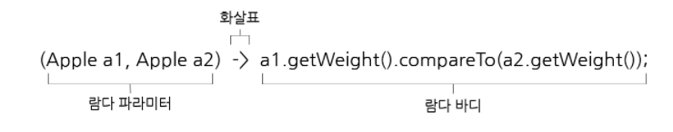

# Lambda

1. **익명 함수(Anonymous functions)**을 지칭한다. 
2. 수학에서 사용는 함수를 보다 쉽고 단순하게 표한하는 방법이다.
3. 두 개 이상의 입력이 이 있는 함수는 1개의 입력만 받는 람다 대수로 단순화 될 수 있다. 

   ( Curring)

### 익명함수 ?

- 함수의 이름이 없는 함수
- 일급 객체(First Class citizen)
    - 일반적으로 다른 객체들에 적용 가능한 연산을 모두 지원하는 개체이다.
    - 함수 값은 물론, 파라미터로 전달 및 변수에 대입 하는 연산도 가능하다.

## 장점

- 코드의 간결성 - 불필요한 반복문의 삭제가 가능하며 복잡한 식을 단순하게 표한할 수 있다.
- 지연연산 수행 - 지연연상으로 불필요한 연산을 최소화 할 수 있다.
- 병령처리 기능 - Multi Thread  로 병렬처리가 가능하다.
- 가독성 증가 - 식에 개발자의 의도가 명확히 드러나 가독성이 높아진다.

## 단점

- 재사용 불가 - 람다를 사용하면서 만든 무명함수는 재사용이 불가능하다.
- 디버깅의 어려움
- 람다를 남발하면 비슷한 함수가 중복 생성되어 오히러 가독성이 떨어진다.
- lambda stream 사용 시 단순 for문 or while문 사용 시 성능이 떨어진다.
- 재귀로 만들 경우에 부적합하다.

## Lambda의 표현식

- 매개변수 화살표 ( ->) 함수몸체로 이용하여 사용 할 수 있다.
- 함수몸체가 단일 실행문이면 괄호{} 를 생략 할 수 있다.
- 골호 안의 문장이 return 문일 경우 괄호 {} 를 생략할 수 없다.

- 파라미터 리스트
    - 파라미터 타입 생략가능
    - 파라미터가 하나일때 () 생략 가능
- 화살표
- 람다 바디

- 표현식 스타일 (Expression Style) 람다
    
    **(parameters) -> expression** 
    
- 블록 스타일 (Block Style) 람다
    
    **(parameterts) -> {block;}**
    

# **Stream**

- 데이터 처리연산을 지원하도록 소스에서 추출된 연속된 요소이다.
1. 연속된 요소
    - 특정 요소 형식으로 이루어진 연속된 값 집합 인터페이스를 제공한다
    - filter, sorted, map 과 같은 데이터를 처리하기 위한 계산식이 주를 이룬다.
2. 소스
    - Collection, 배열, I/O 자원 등의 데이터 제공 소스로 부터 데이터를 소비한다.
3. 데이터 처리연산
    - filter, map, reduce, find, match, sort 등의 함수형 프로그래밍 언어에서 일반적으로 지원하는 연산과 데이터베이스와 비슷한 연산을 지원한다.
4. 내부반복 사용
    - 반복자를 사용할 필요가 없다
        - 내부에서 자동으로 반복을 처리해주기 때문에 사용자가 직접 반복문을 처리할 필요가  없다.
    - 병렬성 처리의 이점
        - 외부반복의 경우 병렬처리를 위해서는 스레드간의 공유자원에 대한 동기화를 처리해줘야 하지만 , 내부반복을 사용한다면 이를 관리할 필요가 없다.
        - 쓰레드간의 동기화 —> 한순간에  한 스레드만 고융자원에 접근하는 코드를 실행하도록 하는 것

## Stream의 사용

Stream에서 사용될 데이터이다.

### 1. 필터링

### filter

- 프리디케이드(boolean을 반환하는 함수)를 인수로 받아 true를 반환하는 모든 요소를 포함하는 스트림을 반환한다.
    
    
    

각 요소가 3보다 큰 경우를 찾아 스트림으로 반환한다.

### distinct

- stream안의 중복된 요소를 제거하는 연산이다. 중복된 1, 2 를 고유하게 만들어준다.
    
    
    

### takeWhile

- stream의 요소가 filter의 비교 대상을 기준으로 순서대로 정렬되어 있는 경우, 인수로 전달받은 프리디케이트가 처음으로 false를 반환하기 전까지의 요소들을 포함한다.
- filter는 모든 요소들을 순회하며 조건을 검사하는 반면, takeWhile은 특정 조건에 일치하는 동안만 요소를 순회하기 떄문에 stream의 요소가 많은 경우 효울성이 매우 높다.

### dropWhile

- 인수로 전달받은 프리디케이트가 true를 반환하는 모든 요소를 버리고, 나머지 요소들을 포함하는 stream을 반환한다.

### 2. 매핑

### map

- stream을 새로운 stream으로 변환하는 연산을 한다. 아래 예제의 경우 원래의 Integer Stream을 String Stream으로 변환하는 예제이다.
    
    
    

### 3. 검색, 매칭

### anyMatch

- 인수로 전달받은 프리디케이트가 true를 반환하는 요소가 하나라도 존재한다면 true값을 반환한다.
    
    
    

### noneMatch

- 인수로 전달받은 프리디케이트가 true를 반환하는 요소가 존재하지 않는 경우 true를 반환한다.
- anyMatch와 정반대의 연산을 진행한다.
    
    
    

### findFirst

- 스트림에서 첫번째 요소를 찾아 반환한다.
- Stream은 여러가지 연산을 거칠 수 있으며 연산의 결과를 Stream에 한개의 요소도 포함이 되어있지 않을 숟 있다. 따라서 Optional을 통해 null관련 에러를 피할 수 있다.
    
    
    

### 4. 리듀싱

- 모든 스트림의 요소를 처리하여 하나의 값으로 도출한다. 즉,  스트림의 요소가 하나의 값으로 줄어들 때 까지 람다는 각 요소를 반복하여 연산 및 조합을 한다.
    
    
    

- 반복연산 대신 reduce 사용 이유
    - 반복연사 사용 시 병렬적으로 처리하기 위해서는 동기화 작업이 필요하다. 동기화를 하더라도 결국 병렬화로 얻는 이득이 스레드간의 소모적 경쟁 때문에 상쇄되어버린다.
        
        반면 reduce 사용하면 병렬작업을 편히하게 이용할 수 있다.
        
- reduce를 통한 병렬작업에서의 제한사항
    - 람다에서 사용되는 변수값이 외부의 코드를 통해 바뀌면 안된다.
    - 결과값이 연산 순서에 영향을 받으면 안된다.

참조링크  

[https://khj93.tistory.com/entry/JAVA-람다식Rambda란-무엇이고-사용법](https://khj93.tistory.com/entry/JAVA-%EB%9E%8C%EB%8B%A4%EC%8B%9DRambda%EB%9E%80-%EB%AC%B4%EC%97%87%EC%9D%B4%EA%B3%A0-%EC%82%AC%EC%9A%A9%EB%B2%95)

[https://dev-kani.tistory.com/38](https://dev-kani.tistory.com/38)

[https://mangkyu.tistory.com/113](https://mangkyu.tistory.com/113)

[https://www.baeldung.com/java-stream-sum](https://www.baeldung.com/java-stream-sum)

[https://galid1.tistory.com/674](https://galid1.tistory.com/674)